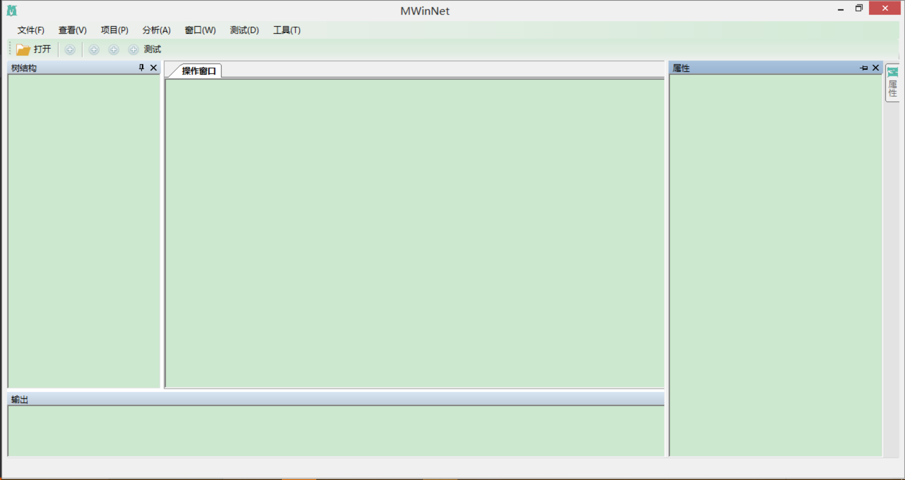

# MWinNet

## 框架介绍
[MWinNet](https://github.com/MrocCyen/MWinNet)是基于.Net winform平台的插件式开发框架，可以根据配置文件自定义界面，通过实现框架的命令接口实现相应的功能，达到功能与界面的完全分离，添加新功能只需要将配置文件和对应的dll放入相应的文件夹内，完全插件化。



目前框架的编写已经完成了主菜单、浮动窗体、工具栏和状态栏，右键菜单还需要完善。希望大家可以多多提提意见，共同进步，同时如果你觉得这个项目还行，欢迎[fork&star](https://github.com/MrocCyen/MWinNet)。

## 框架结构
### 核心结构
#### MWinNet.Core
整个框架的核心，主要包括插件的初始化，插件树的构造，命令接口定义和通用工具类的定义。Plugin和PluginTree是插件系统的核心，每个配置文件项都对应一个插件，比如：

```
 <MenuItem path="/MWinNet/Menu/File/Create"
        id="Create"
        caption="Create"
        image="Resource\MainFrame\Test.png"
        index="0"
        assemblyName="MWinNet.MainFrame.dll"
        className="MWinNet.MainFrame.CreateCommand">
</MenuItem>
```

系统初始化的时候会读取配置文件，然后根据不同的标签构造相应的Plugin对象，然后构造插件树。

除此之外，Core中还有文件操作，字符串操作等公用的工具类。

#### MWinNet.Frame
包括界面类型的定义和框架界面的构造。界面类型包括Menu、WrokBench、DockBar、StatusBar和ContextMenu等。界面构造根据PluginTree中的Plugin构造出对应的界面对象，然后加进主界面中。

IViewContent接口是给DockWindow中添加控件的接口，每个实现了IViewContent接口的类都有与之对应的DockWindow，控件的初始化就可以放在实现了IViewContent接口的类中。

#### MWinNet.Dock
类库基于WeifenLuo.WinFormsUI.Docking修改而来，支持浮动窗口的所有特性。

## 框架指南

### 配置文件
配置文件示例格式如下：

```
<Plugin  name="FrameConfig"
           author="meaglecyen"
           version="1.0.0"
           description=""
           initialized="true">

  <Menu>
    <MenuTab path="/MWinNet/Menu/File" id="File" caption="File(F)"  index="0"></MenuTab>
    <MenuTab path="/MWinNet/Menu/View" id="View" caption="View(V)" index="1"></MenuTab>

    <MenuItem path="/MWinNet/Menu/File/Create"
              id="Create"
              caption="Create"
              image="Resource\MainFrame\Test.png"
              index="0"
              assemblyName="MWinNet.MainFrame.dll"
              className="MWinNet.MainFrame.CreateCommand">
    </MenuItem>

    <MenuDropGroup path="/MWinNet/Menu/File/Open"
              id="Open"
              caption="Open"
              image=""
              index="1">
      <MenuItem path="/MWinNet/Menu/File/Open/Project"
                id="Project"
                caption="Project"
                image=""
                index="0">
      </MenuItem>
      <MenuItem path="/MWinNet/Menu/File/Open/TreeLir"
                 id="TreeLir"
                 caption="TreeLir"
                 image="Resource\MainFrame\Test.png"
                 index="1">
      </MenuItem>
    </MenuDropGroup>
  </Menu>

  <DockBar>
    <DockItem path="/MWinNet/DockBar/Frame/Left"
              id="Left"
              dockType="DockLeft"
              dockWindowClass="MWinNet.MainFrame.WorkTreeWindow"
              assemblyName="MWinNet.MainFrame.dll">
    </DockItem>
    <DockItem path="/MWinNet/DockBar/Frame/Right"
              id="Right"
              dockType="DockRightAutoHide"
              dockWindowClass="MWinNet.MainFrame.WorkPropertyWindow"
              assemblyName="MWinNet.MainFrame.dll">
    </DockItem>
    <DockItem path="/MWinNet/DockBar/Frame/Middle"
              id="Middle"
              dockType="Document"
              dockWindowClass="MWinNet.MainFrame.WorkMidWindow"
              assemblyName="MWinNet.MainFrame.dll">
    </DockItem>
    <DockItem path="/MWinNet/DockBar/Frame/Middle"
              id="Middle"
              dockType="Document"
              dockWindowClass="MWinNet.MainFrame.WorkMidWindow"
              assemblyName="MWinNet.MainFrame.dll">
    </DockItem>
    <DockItem path="/MWinNet/DockBar/Frame/Buttom"
          id="Buttom"
          dockType="DockBottomAutoHide"
          dockWindowClass="MWinNet.MainFrame.OutputWindow"
          assemblyName="MWinNet.MainFrame.dll">
    </DockItem>
  </DockBar>

   <ToolBar>
    <!--displayStyle="Image"||"Text"||"ImageAndText"-->
    <ToolBarButton path="/MWinNet/ToolBar/ToolBarButton/Open"
              id="open"
              displayStyle="ImageAndText"
              image="Resource\MainFrame\Open.png"
              label="Open"
              index="0"
              assemblyName="MWinNet.MainFrame.dll"
              className="MWinNet.MainFrame.CreateCommand">
    </ToolBarButton>
    <ToolBarSeparator path="/MWinNet/ToolBar/ToolBarSeparator/1" id="1"></ToolBarSeparator>
    <ToolBarButton path="/MWinNet/ToolBar/ToolBarButton/Open1"
                id="open1"
                displayStyle="Image"
                image="Resource\MainFrame\Test.png"
                label="Open1"
                index="1"
                assemblyName="MWinNet.MainFrame.dll"
                className="MWinNet.MainFrame.CreateCommand">
    </ToolBarButton>
    <ToolBarSeparator path="/MWinNet/ToolBar/ToolBarSeparator/2" id="2"></ToolBarSeparator>
  </ToolBar>

  <StatusBar>
    <StatusProgressBar path="/MWinNet/StatusBar/ProgressBar/1" id="1" value="50" length="250"></StatusProgressBar>
    <StatusLabel path="" id="" label=""></StatusLabel>
  </StatusBar>

</Plugin>
```

#### Menu节点
 Menu是菜单节点，所有的菜单项都在该节点下定义，在Menu节点中有三个子节点，MenuTab、MenuGroup、MenuItem。MenuTab是每个菜单Tab的定义节点，MenuItem是每个菜单项的定义节点，MenuGroup可以包含一个或者多个MenuItem节点。

 属性：

 - path：每个菜单项都对应一个路径，该路径会添加进插件树中相应的分支中。
 - id：每个菜单项的唯一标识。
 - caption：每个菜单项的名称。
 - image：每个菜单项的图标。
 - index：菜单项索引值。
 - assemblyName：菜单项命令对应的类名所在的程序集。
 - className：菜单项命令对应的类名，需要加上命名空间。
 
#### DockBar节点
DockBar是浮动窗口节点。所有的浮动的窗口的定义都在DockBar节点中。
DockBar下有DockItem子节点，定义每个浮动窗口的属性。

属性：

- path：每个浮动窗口对应一个路径，该路径会添加进插件树中相应的分支中。
- id：DockBar唯一的标识。
- dockType：DockBar的类型，有Float、DockTopAutoHide、DockLeftAutoHide、DockBottomAutoHide、DockRightAutoHide、Document、DockTop、DockLeft、DockBottom和DockRight。
- dockWindowClass：浮动窗体对应的窗体类型名，需要加上命名空间。
- assemblyName：浮动窗体对应的窗体所在的程序集。

### ToolBar节点
ToolBar是工具栏节点。所有工具栏的按钮都定义在ToolBar节点中。

#### ToolBarButton子节点：
工具栏按钮定义节点。

属性：

- path：每个工具栏按钮对应一个路径，该路径会添加进插件树中相应的分支中。
- id：ToolBarButton唯一的标识。
- displayStyle：样式展示类型，有Image、Text和ImageAndText。
- image：图片路径。
- label：显示的文本。
- index：排序索引值。
- assemblyName：所在的程序集。
- className：按钮命令对应的类名，需要加上命名空间。

#### ToolBarSeparator子节点：

分隔标记定义节点。

属性：

- path：每个工具栏分隔标记对应一个路径，该路径会添加进插件树中相应的分支中。
- id：ToolBarSeparator唯一的标识。

### StatusBar节点

StatusBar是状态栏节点，目前只支持了进度条和标签的设置。

#### StatusProgressBar子节点

进度条子节点，可以通过设置实现相应的进度信息展示的功能。

属性：

- path：每个进度条对应一个路径，该路径会添加进插件树中相应的分支中。
- id：StatusProgressBar唯一的标识。
- value：进度初始值。
- length：进度条长度。

#### StatusLabel子节点

状态栏标签。

属性：

- path：每个标签对应一个路径，该路径会添加进插件树中相应的分支中。
- id：StatusLabel唯一的标识。
- label：标签的展示文本。

### Command

每个界面元素，如菜单、工具栏等都可以点击然后去实现相应的功能，通过抽象，我把功能代码从界面中抽离了出来，单独放在了一个实现了Command接口的类中。

command类实现了ICommand接口，里面有两个方法:

```
    public abstract class Command : ICommand
    {
        public abstract void Run();
        public abstract bool Enable();
    }
```

- Run：具体的功能代码。
- Enable：设置是否可用。

示例：

```
    public class CreateCommand : Command
    {
        public override bool Enable()
        {
            return true;
        }

        public override void Run()
        {
            MessageBox.Show("Hello World！");
        }
    }
```

### IViewContent

IViewContent接口是给DockWindow中添加控件的接口。

```
    public interface IViewContent
    {
        Control ViewControl { get; set; }
    }
```

实现IViewContent可以给需要添加的窗口添加控件，这样让窗体尽可能多的关系业务逻辑。

示例代码：

```
    public class MidViewContent : IViewContent
    {
        public MidViewContent()
        {

        }

        private RichTextBox _box = new RichTextBox();
        public Control ViewControl
        {
            get
            {
                _box.Dock = DockStyle.Fill;
                _box.Name = "RichTextBox";
                return _box;
            }
            set
            {
                _box = (RichTextBox)value;
            }
        }
    }
```
